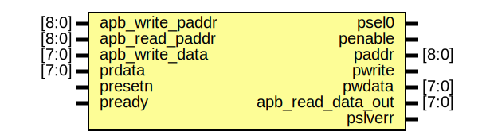
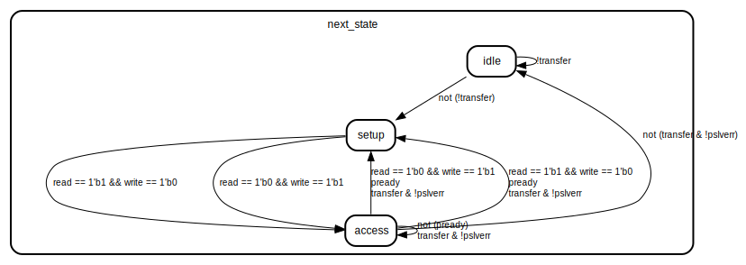

# Entity: APB_Bridge 
- **File**: APB_Bridge.v

## Diagram

## Ports

| Port name         | Direction | Type  | Description |
| ----------------- | --------- | ----- | ----------- |
| apb_write_paddr   | input     | [8:0] |             |
| apb_read_paddr    | input     | [8:0] |             |
| apb_write_data    | input     | [7:0] |             |
| prdata            | input     | [7:0] |             |
| presetn           | input     |       |             |
| pclk              |           |       |             |
| read              |           |       |             |
| write             |           |       |             |
| transfer          |           |       |             |
| pready            | input     |       |             |
| psel0             | output    |       |             |
| psel1             |           |       |             |
| penable           | output    |       |             |
| paddr             | output    | [8:0] |             |
| pwrite            | output    |       |             |
| pwdata            | output    | [7:0] |             |
| apb_read_data_out | output    | [7:0] |             |
| pslverr           | output    |       |             |

## Signals

| Name                | Type      | Description |
| ------------------- | --------- | ----------- |
| present_state       | reg [1:0] |             |
| next_state          | reg [1:0] |             |
| invalid_setup_error | reg       |             |
| setup_error         | reg       |             |
| invalid_read_paddr  | reg       |             |
| invalid_write_paddr | reg       |             |
| invalid_write_data  | reg       |             |

## Constants

| Name   | Type | Value | Description |
| ------ | ---- | ----- | ----------- |
| idle   |      | 2'b00 |             |
| setup  |      | 2'b01 |             |
| access |      | 2'b10 |             |

## Processes
- unnamed: ( @(posedge pclk) )
  - **Type:** always
- unnamed: ( @(present_state, transfer, pready) )
  - **Type:** always
- unnamed: ( @(*) )
  - **Type:** always

## State machines

