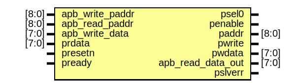

# APB_Interface_Simulation

This is a simulation project based on APB Protocol, simulated on Xilinx Vivado using AMBA APB specifications and FSM to transfer data. The input data timing format for the APB interface is customized as written in the testbench. 

# Entity: APB_Bridge 
- **File**: APB_Bridge.v

## Diagram

## Ports

| Port name         | Direction | Type  | Description |
| ----------------- | --------- | ----- | ----------- |
| apb_write_paddr   | input     | [8:0] |             |
| apb_read_paddr    | input     | [8:0] |             |
| apb_write_data    | input     | [7:0] |             |
| prdata            | input     | [7:0] |             |
| presetn           | input     |       |             |
| pclk              |           |       |             |
| read              |           |       |             |
| write             |           |       |             |
| transfer          |           |       |             |
| pready            | input     |       |             |
| psel0             | output    |       |             |
| psel1             |           |       |             |
| penable           | output    |       |             |
| paddr             | output    | [8:0] |             |
| pwrite            | output    |       |             |
| pwdata            | output    | [7:0] |             |
| apb_read_data_out | output    | [7:0] |             |
| pslverr           | output    |       |             |

## Signals

| Name                | Type      | Description |
| ------------------- | --------- | ----------- |
| present_state       | reg [1:0] |             |
| next_state          | reg [1:0] |             |
| invalid_setup_error | reg       |             |
| setup_error         | reg       |             |
| invalid_read_paddr  | reg       |             |
| invalid_write_paddr | reg       |             |
| invalid_write_data  | reg       |             |

## Constants

| Name   | Type | Value | Description |
| ------ | ---- | ----- | ----------- |
| idle   |      | 2'b00 |             |
| setup  |      | 2'b01 |             |
| access |      | 2'b10 |             |

## Processes
- unnamed: ( @(posedge pclk) )
  - **Type:** always
- unnamed: ( @(present_state, transfer, pready) )
  - **Type:** always
- unnamed: ( @(*) )
  - **Type:** always

## State machines

# Entity: APB_Slave 
- **File**: APB_Slave.v

## Diagram

## Ports

| Port name | Direction | Type  | Description |
| --------- | --------- | ----- | ----------- |
| pclk      | input     |       |             |
| presetn   |           |       |             |
| penable   | input     |       |             |
| psel      | input     |       |             |
| pwrite    | input     |       |             |
| paddr     | input     | [7:0] |             |
| pwdata    | input     | [7:0] |             |
| prdata    | output    | [7:0] |             |
| pready    | output    |       |             |

## Signals

| Name      | Type      | Description |
| --------- | --------- | ----------- |
| mem[63:0] | reg [7:0] |             |

## Constants

| Name  | Type | Value | Description |
| ----- | ---- | ----- | ----------- |
| IDLE  |      | 2'b00 |             |
| WRITE |      | 2'b01 |             |
| READ  |      | 2'b10 |             |

## Processes
- unnamed: ( @(posedge pclk or negedge preset_n) )
  - **Type:** always

## State machines

